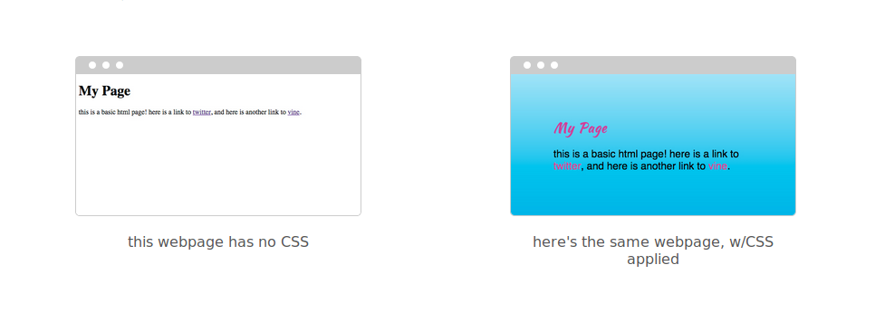
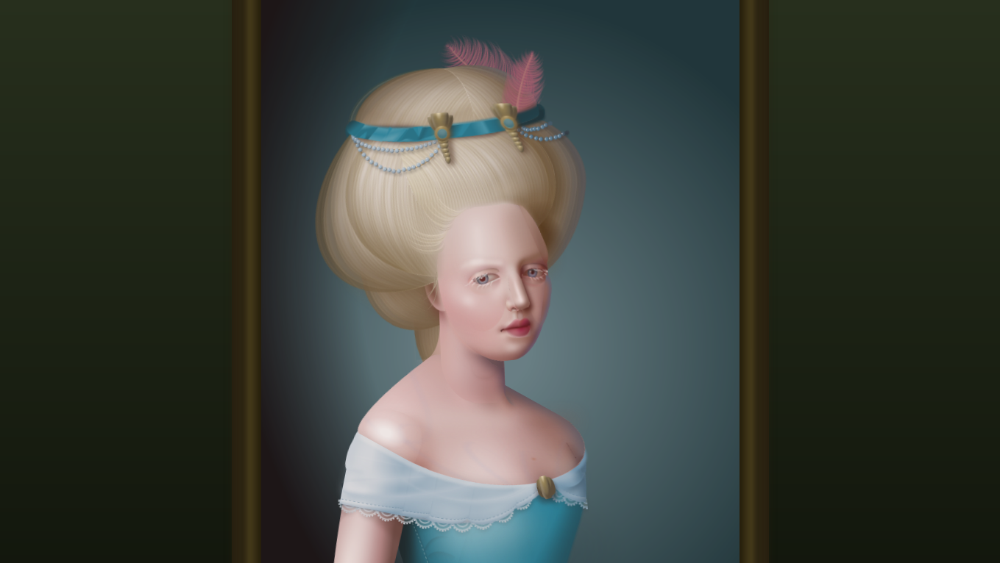
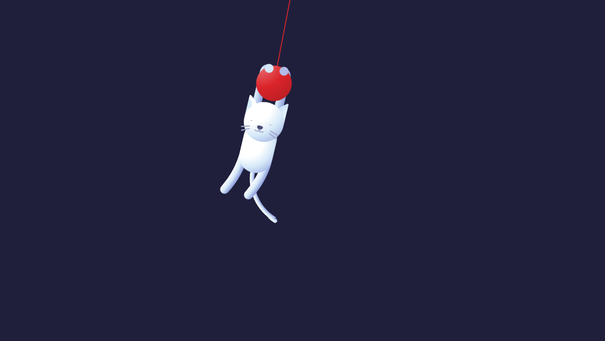
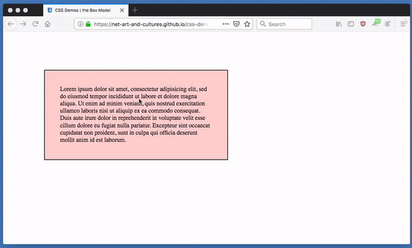

# Cascading Style Sheets (CSS)

the point of CSS (Cascading Style Sheets) is to separate “presentation” (CSS) from “content” (HTML). the separation of a document’s content && its presentation is a popular tech-design philosophy/methodology. it means u can display the same content (HTML) in different ways (w/different styles) for different contexts: laptops, smart phones, in print, on a braille tactile device, etc. it also means a text-to-speech app can understand what’s “content” && what’s not + reader-views/apps can override the default CSS && use alternative “presentations”. depending on how u implement ur CSS, it also enables u to make site-wide changes in a single document which can make updating (even redesigning the entire aesthetic) a site drastically easier.

when the web was first introduced in 1990 there was only HTML which handled both the content and the presentation, but fairly quickly there were a few proposals for separating style presentation from content. one such proposal for a style language came from Håkon W Lie who [debuted CHSS](http://www.w3.org/People/howcome/p/cascade.html) (Cascading HTML Style Sheets, later renamed CSS) at a Web conference in Chicago in 1994. but proposals don't become a reality that web-developers can use until browser companies implement the recommendations in their software. the first to implement CSS was Microsoft Internet Explorer 3 in 1996 (Netscape, the other top browser of the time, followed shortly after).

if u want to learn more about CSS history check out this amazing blog post [The Languages Which Almost Became CSS](https://eager.io/blog/the-languages-which-almost-were-css/) by Zack Bloom, or [ch 20](http://www.w3.org/Style/LieBos2e/history/) of Håkon Wium Lie && Bert Bos (the original inventors of CSS) book Cascading Style Sheets: Designing for the Web as well as the [history sections](https://books.google.com/books?id=jAGSAwAAQBAJ&lpg=PA1927&dq=Sfetcu%2C%20Nicolae.%20Web%20Design%20%26%20Development%3A%20Nicolae%20Sfetcu%2C%202014&pg=PT75#v=onepage&q&f=false) in Web Design & Development By Nicolae Sfetcu)

CSS has been evolving ever since. everyone/anyone interested in the future of CSS is subscribed to the [www-style](http://lists.w3.org/Archives/Public/www-style/) mailing list where discussions about the CSS specification (the design that browser makers follow) take place. included in this email group are the members of [the CSS Working Group](http://www.w3.org/Style/CSS/members) (some of whom work at companies who make browsers), they have the final say on what should/shouldn't be a part of CSS. when they release recommendations or changes to the spec it's up to the browser vendors (companies) to update their software to properly render the new CSS. sometimes that takes a bit, which is why when new CSS properties are decided on by the working group, it might be a while before they work in all browsers. a great website to check whether or not a particular browser has implemented a particular CSS feature is [caniuse.com](http://caniuse.com/)

u can check out the latest CSS happenings at the working group's [current work](http://www.w3.org/Style/CSS/current-work) page && even if u don't subscribe to the mailing list, the email discussion is all public && accessible [here](http://lists.w3.org/Archives/Public/www-style/) && if one day u decide u are interested in participating in the development of the CSS spec, [start here](http://www.w3.org/Style/CSS/current-work#contribute))

# [CSS Art](gallery.md)

 > "Francine" by CSS Dev [Diana A. Smith](https://diana-adrianne.com/)

today CSS has grown into an incredibly expressive language. it can do much more than simply layout the contents of a web page, u can now create all kinds interactions && animations w/CSS, u could even create an [entire video game](https://codepen.io/jcoulterdesign/pen/NOMeEb) from CSS (though this is an incredible technical achievement, i wouldn't recommend making video games w/CSS, JavaScript && other languages are much better suited for that sort of thing... but it's cool to see how far creative coders have pushed the language :)

> "Swinging Cat" by CSS Dev [David Khourshid](https://codepen.io/davidkpiano)

For some CSS Art Inspiration check out the various pieces collected in the [**CSS ART GALLERY**](gallery.md)

# CSS Demos

the following is by no means an exhaustive list of CSS properties (u can check those out [here](https://developer.mozilla.org/en-US/docs/Web/CSS/Reference) or [here](https://css-tricks.com/almanac/)), nor is it a general guide to all CSS features (for that checkout Jon Duckett's book [HTML & CSS](http://www.htmlandcssbook.com/) or the Mozilla Developers Network's [CSS tutorials](https://developer.mozilla.org/en-US/docs/Web/Guide/CSS/Getting_started)). the following are some examples/demos highlighting specific CSS properties or issues/questions i often get asked about in class (i can add more to this page if there's something we end up covering in class that isn't on here, just send me an email about what u'd like to see explained)

u can follow the examples below in order (it more or less goes from basic to less-basic) or u can jump around to specific topics u want to learn more about. clicking the links will take u to another page w/documentation on that particular subject && those pages will link to different HTML pages w/the CSS examples in them.

in addition to reading the notes associated with each example, i highly recommend that u also right-mouse click (or CTRL+click or two-finger click w/ur track-pad) on the different elements on the example pages to inspect them w/the Web Inspector i showed u in class. this way u can experiment w/them by changing their CSS values or adding some properties of ur own. playing w/these examples in the Web Inspector is a great way to better understand this stuff. (*FYI, u can switch ur web developer tools from light theme to dark theme in the settings, which u can get to by clicking the gear icon, sometimes hidden behind the 3 dots icon, on the top-left corner of the dev tools*)

### start here

[an introduction to CSS](basics.md)

### the basics

[the "Cascade" in Cascading Style Sheets](demos/notes/the-cascade.md)

[different units of measurement.](demos/notes/css-units.md)

[there are lots of ways to specify colors.](demos/notes/css-colors.md)

[HTML elements are all boxes.](demos/notes/the-box-model.md)

[there's a bunch of ways to center things.](demos/notes/centering-things.md)

[how to change CSS when u hover && CSS Transitions.](demos/notes/hover-transitions.md)

[Typography + Custom Fonts](demos/notes/typography.md)

### layout

[the position property.](demos/notes/position.md)

[the transform property.](demos/notes/transform.md)

[old-school approaches to grid layout](demos/notes/layout-old.md) (for context).

[modern approaches to grid layout: Flexbox && CSS Grids](demos/notes/layout-modern.md)

### Responsive Web Design...

[...also known as "mobile first"](demos/notes/media-queries.md)

### CSS animations...

[...in a bit more depth than we covered in class](demos/notes/css-animations.md)

## epilogue

[vendor (browser) prefixes && future CSS](demos/notes/vendor-prefixes.md)
