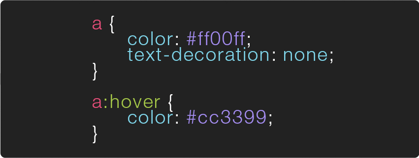

# CSS Properties

CSS consists of a list of properties which can be assigned different values to change various characteristics of your HTML elements. u can apply CSS properties to a particular element on ur page by including them in that element's `style` attribute like so:

```html
<div style="font-size:24px;color:white;"> hello there! </div>
```

here we change the `<div>`'s `font-size` to `24px` && it's `color` to `white`. notice that the property is always followed by a `:` (colon) && the value is always followed by a `;` (semi-colon). these are the two main pieces of syntax for a CSS "declaration" (ie. a CSS property && value pair)


here's a list of some of the most commonly used properties:

| CSS property | description |
|:---:|:---:|
| [background-color](https://developer.mozilla.org/en-US/docs/Web/CSS/background-color) |The background-color CSS property sets the background color of an element, either through a color value or the keyword transparent.|
| [background-image](https://developer.mozilla.org/en-US/docs/Web/CSS/background-image) |The CSS background-image property sets one or several background images for an element. The images are drawn on stacking context layers on top of each other. The first layer specified is drawn as if it is closest to the user.|
| [border](https://developer.mozilla.org/en-US/docs/Web/CSS/border) |The border CSS property is a shorthand property for setting the individual border property values in a single place in the style sheet. border can be used to set the values for one or more of: border-width, border-style, border-color.|
| [color](https://developer.mozilla.org/en-US/docs/Web/CSS/color) |The color property sets the foreground color of an element's text content, and its decorations. It doesn't affect any other characteristic of the element; it should really be called text-color and would have been named so, save for historical reasons and its appearance in CSS Level 1.|
| [font-family](https://developer.mozilla.org/en-US/docs/Web/CSS/font-family) |The font-family CSS property lets you specify a prioritized list of font family names and/or generic family names for the selected element. Values are separated by a comma to indicate that they are alternatives. The browser will select the first font on the list that is installed on the computer or that can be downloaded using a @font-face at-rule.|
| [font-size](https://developer.mozilla.org/en-US/docs/Web/CSS/font-size) |The font-size CSS property specifies the size of the font (historically the width of the capital "M"). Setting the font size may, in turn, change the size of other items, since it is used to compute the value of the em and ex <length> units.|
| [margin](https://developer.mozilla.org/en-US/docs/Web/CSS/margin) |The margin CSS property sets the margin for all four sides. It is a shorthand to avoid setting each side separately with the other margin properties: margin-top, margin-right, margin-bottom and margin-left.|
| [padding](https://developer.mozilla.org/en-US/docs/Web/CSS/padding) |The padding property sets the padding space on all sides of an element. The padding area is the space between the content of the element and its border. Negative values are not allowed.|
| [position](https://developer.mozilla.org/en-US/docs/Web/CSS/position) |The position CSS property chooses alternative rules for positioning elements, designed to be useful for scripted animation effects.'|
| [text-decoration](https://developer.mozilla.org/en-US/docs/Web/CSS/text-decoration) |The text-decoration CSS property is used to set the text formatting to underline, overline, line-through or blink. Underline and overline decorations are positioned under the text, line-through over it.|

for a full list of all CSS properties visit the Mozilla Developer Network's [CSS Reference](https://developer.mozilla.org/en-US/docs/Web/CSS/Reference) page.


# CSS Rules

u can apply a set of CSS delcarations to multiple elements at once using CSS rules. a CSS "rule" (colloquially referred to as a CSS “class”) contains two parts, a **selector** which specifies which element(s) the rules will be applied to + a `{` **declaration block** `}`, surrounded by curly brackets, which specifies how the element should be styled.

the declaration, as stated above, is split in two parts, the **property** which indicates the aspect of the element u want to change (ex: color, font, width, border) && the **value** which is the setting u want to use for that specific property.


the example above uses a **type selector**, which means it will apply the rules to every `<a>` tag on the page. u can apply the same rule to multiple elements by including them in a comma separated list w/in the selector. for example `h1, h2, h3 { color: purple; }` will change the color of all the `<h1>`, `<h2>` && `<h3>` tags on the page to purple.

there are many other kinds of selectors which give u different ways of targeting specific elements to apply ur CSS rules to. the most common selector is likely to be the **class selector** which targets any element whose class attribute’s value matches that of the class name.


there are a number of different kinds of selectors (&& thus a number of ways to specify which elements on a page u want to apply a CSS rule to), the most common are:

| CSS selector | description |
|:---:|:---:|
|`* { }` **Universal Selector**|this rule will apply to all elements on a page|
|`p { }` **Type Selector**|this rule will apply to all elements of the specified type (in this case `<p>`)|
|`.stuff { }` **Class Selector**|this rule will apply to all elements w/a class attribute that matches it (for example `<div class="stuff">`), u can mix type/class selectors like this` p.stuff { }`, that will only target p tags with a `class="stuff"`|
|`#info { }` **ID Selector**|this rule will apply to all elements w/an id attribute that matches it (for example `<div id="info">`)|

selector’s can also be followed by **pseudo-classes**, which specify a particular “state” the element can be in. the example below shows a very common use of the `:hover` pseudo-class.



similarly, selector’s can also be followed by **pseudo-elements** ( :: instead of : ), rather then specify a special state, pseudo-elements target a specific part of the targeted element, for example `p::first-letter { font-size:32px; }` will make the first letter of every `<p>` element 32px. a [full list of pseudo-classes](https://developer.mozilla.org/en-US/docs/Web/CSS/Pseudo-classes) is available on the mozilla developer network as well as a [full list of pseudo-elements](https://developer.mozilla.org/en-US/docs/Web/CSS/Pseudo-elements). u can also find a list of every CSS selector and property in CSS-Tricks.com's [almanac](https://css-tricks.com/almanac/).


# Where to put ur CSS code

### inline styles

there are three different ways to incorporate CSS code to ur site, the first is inline (which was demonstrated above), which is generally discouraged. w/this method u don’t write a selector, instead u type CSS properties+values directly into the html tag as a value of its style attribute. this can be helpful when trying to hack around some peculiar situation.

```html
<div style="font-size:24px;color:white;"> hello there! </div>
```


### internal CSS

the second way to include CSS rules is internally, via `<style>` tags ( which go inside the head ). though it’s generally best to use the third method ( external stylesheet ), there are times where u might need to apply a CSS class to only one page on ur site or u might have a simple single-page website && want to cut down on requests to the server by keeping all the code in a single html file.

```html
<head>
  <title> my page </title>
  <style>
    /* CSS code here */
  </style>
</head>
```


### external CSS

the third approach of an external ( or linked ) stylesheet is generally considered the best-practice. here we write all our CSS rules in a separate document ( known as a stylesheet ) saved w/a .css + then attached ( or included ) in the head of ur html page via a `<link>` tag. the link tag needs to include two attributes, an href w/the path to ur .css file && a rel w/the value of stylesheet, this specifies the “relationship” between the page && the file being linked to (this is important b/c there are other files u might want to link to w/a different relationship to the page, for example a [favicon](https://en.wikipedia.org/wiki/Favicon)).

```css
/*
   assuming this is inside a file called "styles.css"
   which is inside a folder called "css"
*/
a {
  color: #ff00ff;
  text-decoration: none;
}

.info {
  font-family: sans-serif;
  font-size: 12px;
  color: #555;
}
```

```html
<!-- assuming this is in an html file -->
  <head>
    <link href="css/styles.css" rel="stylesheet">
  </head>
```

u often see a third attribute in link tags, the type attribute. when linking to a stylesheet the type should be set to “text/css” ( but these days this isn’t really necessary ). u can link more than one stylesheet to ur page, developers often do this in order to keep their stylesheets modular
