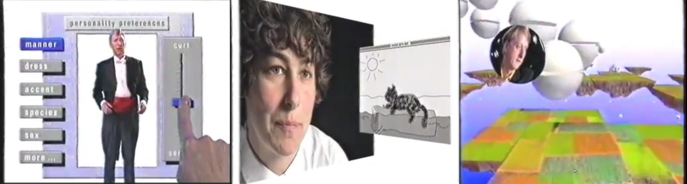
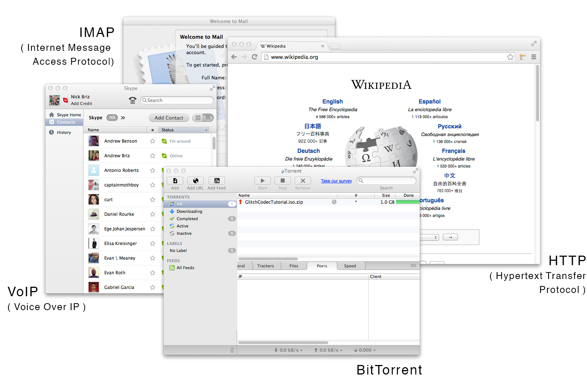
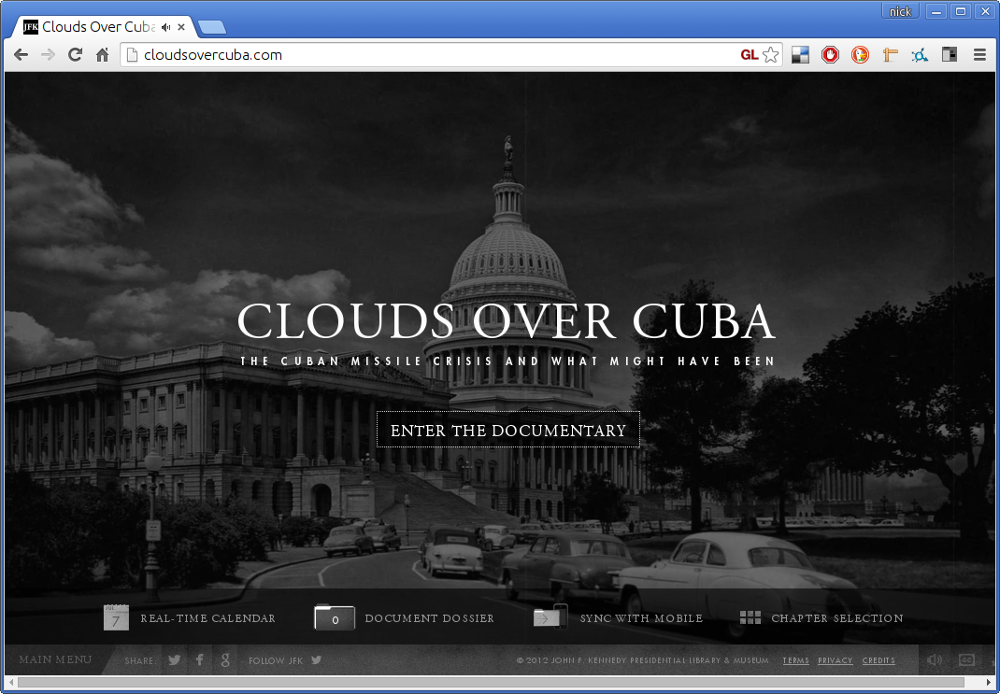
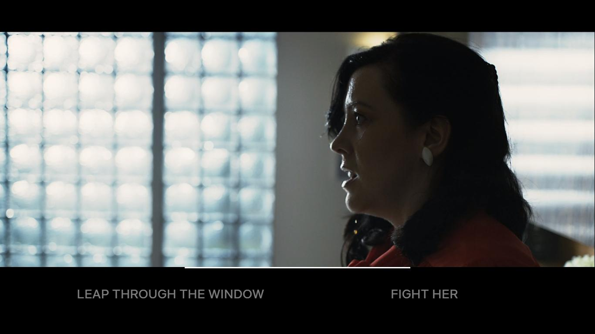

# Hypermedia

In 1945, an American engineer/inventor/thinker named Vannevar Bush wrote an article in the Atlantic entitled, “[As We May Think](http://www.theatlantic.com/magazine/archive/1945/07/as-we-may-think/303881/),” where he described a theoretical machine for storing and reteriving information based on associations ( which he argued would be more akin to the way we think than the way information was currently being organized ) he called it the “memex.” This text influenced lots of radically minded engineers and futurists who followed including [Douglas Englebart](https://www.youtube.com/watch?v=yvx4ObDBGZs) and [Ted Nelson](https://www.youtube.com/channel/UCr_DXJ7ZUAJO_d8CnHYTDMQ), who coined the term [“hypertext”](https://www.historyofinformation.com/detail.php?entryid=1055) and created one of the first applications (called Xanadu) which had linked documents.

## Hypercard

> in 1987 the [Computer Cronicles](https://archive.org/details/CC501_hypercard) did an entire episode on "Hypercard",

> "Inigo Gets Out" by Amanda Goodenough which was featured in the "Hyperland" documentary (try it out on the [Internet Archive](https://archive.org/details/hypercard_inigo_gets_out))

## The WWWeb

The World Wide Web is NOT the Internet, confusing the two would be like confusing cars for roads. the Web is one of the many things we use the Internet for, in the same way that cars are one of the many vehicles that travel on roads.

In 1989 Tim Berners-Lee wrote a proposal for a system for linking hypertext documents over the Internet. He submitted it to his boss at CERN ( the research institute he was working at ), who wrote in a memo, “vague, but interesting.” Despite the lack of support Berners-Lee went ahead and created HTTP ( Hypertext Transfer Protocol ) and the first application which could read documents formatted with HTML ( Hypertext Markup Language ). CERN still wasn’t interested, so he posted it to a few Internet newsgroups for free ...the rest was history, the World Wide Web was born.

Afraid that the growing popularity of the Web might lead to corporate competition creating proprietary ( non-open ) web applications that would destroy the integrity and open nature of the Web, Berners-Lee held the first WWW conference to discuss open web standards. This lead to the creation of the World Wide Web Consortium ([W3C](http://www.w3.org/)) which he still directs to this day. The W3C is an international organization open to anyone ([and made up of governments, companies, not-for-profits, universities, etc.](http://www.w3.org/Consortium/Member/List)) and is in charge of developing the open standards for the web.

## Contemporary Hypermedia Examples

Sesame Street experimented with hypermedia content on YouTube for a while, but YouTube has since discontinued it's "video annotations" feature (which allowed for creating simple hypermedia videos) so though the video is still up, it no longer works as it used to... sadly.

Hypermedia works particular well for documentaries. the John F. Kennedy Presidential Library & Museum released an hypermedia doc called Clouds Over Cuba back in 2012.

The creators of the Netflix series Black Mirror produced a hypermedia film called Bandersnatch, this is one of the most recent (&& mainstream) examples of hypermedia today.
