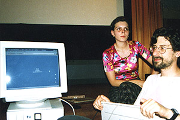
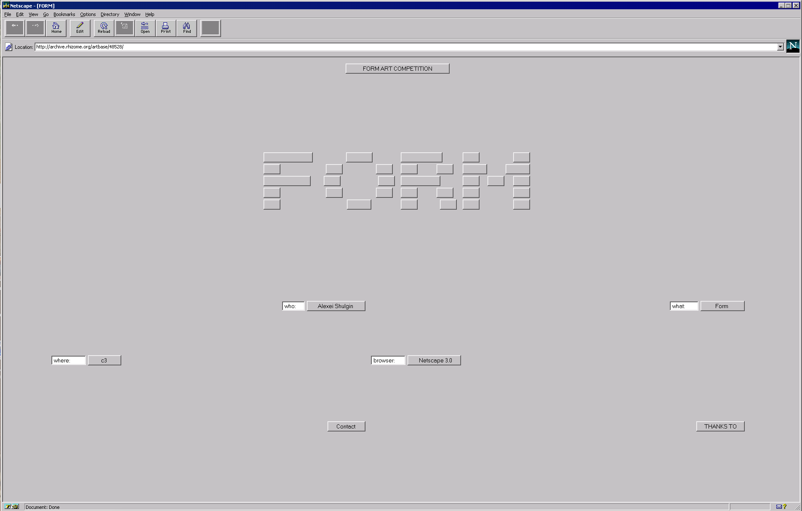
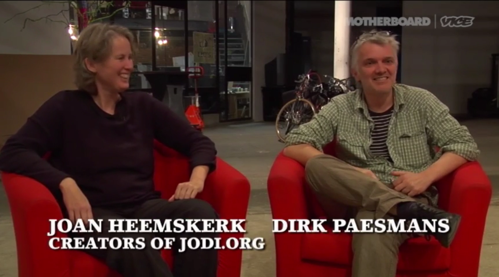
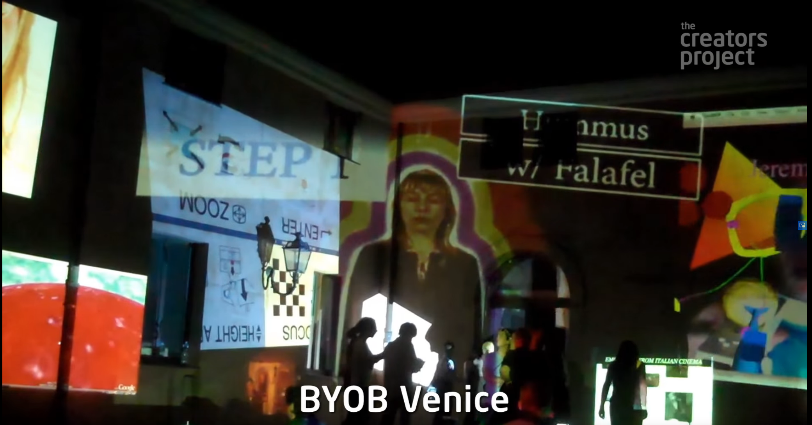
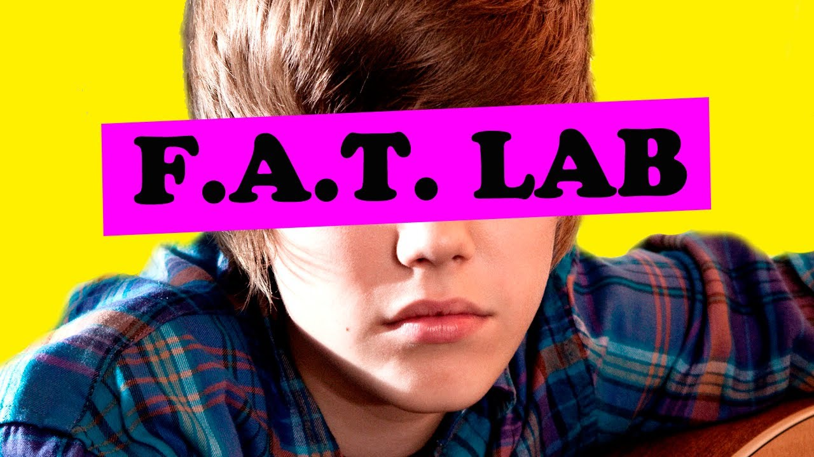
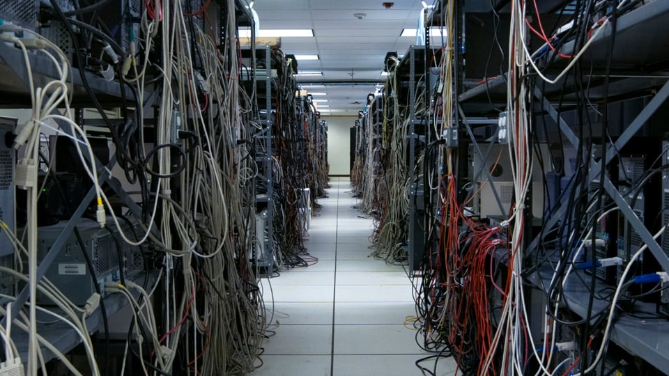

# net.art

for a quick crash course on the early "net.art" movement read Rachel Greene's essay from ArtForum [Web Work: A History of Internet Art](webwork.pdf). i also very much appreciate the summary below form "[digital archeologist](http://digital-archaeology.org/)" Jim Boulton's book [100 Ideas That Changed The Web](https://www.amazon.com/100-Ideas-that-Changed-Web/dp/1780673701?tag=duckduckgo-d-20) (i highly recommended this book, quick/easy read for broad overview on many of the cultural/technical innovations we'll be touching on in this class), check out a preview at [fastcodesign](https://www.fastcompany.com/3034030/9-design-ideas-that-forever-changed-the-web#9). i've augmented his article w/links && videos so take advantage (follow the links + watch the videos).

-----

 In 1952, computer scientist Christopher Strachey developed a program for the Manchester Mark 1 computer that created randomized love letters. It was the first example of computer art. With Strachey's generative love letters, the result is secondary to the process. This typifies computer art and the Net Art movement that followed. Unexpected outcomes are welcome, opening doors rather than closing them. Even the way the genre got its name was serendipitous: ASCII artist Vuk Cosic received a corrupted email in 1995; the only words he could make out were "Net Art."

 
 
 

 Born in Belgrade, Cosic emigrated to Slovenia in the early '90s. While U.S. dotcom companies seized on the commercial potential of the Web, Eastern Europe was critical to its artistic development. The break-up of the Soviet Union created an optimistic, open atmosphere, exemplified by the web. Russian artists [Olia Lialina](http://art.teleportacia.org/olia.html) and [Alexei Shulgin](http://www.easylife.org/) were hugely influential. Lialina's [My Boyfriend Came Back From The War](http://www.teleportacia.org/war/war2.htm), from 1996, is a hypertext narrative, as envisioned by the godfather of hypertext, Vannevar Bush, at the end of World War II. Shulgin's [Form Art](http://www.c3.hu/collection/form/) manipulates HTML's layout capabilities, using checkboxes, radio buttons and text fields to create forms. The appearance varies from browser to browser, evolving with every release, as if it were alive.

 

 
 > what Form Art looks like [today](http://www.c3.hu/collection/form/), what it looked like [then](https://sites.rhizome.org/anthology/form-art.html)

 Many of the early online art projects addressed technology as the subject matter, as well as the medium. [Heath Bunting](http://irational.org/cgi-bin/cv2/temp.pl)'s [King's Cross Phone-In](http://www.irational.org/cybercafe/xrel.html) (1994) demonstrated the power of network technology. Bunting listed the telephone numbers of the public phones at London's King's Cross station on his website and encouraged visitors to call the numbers at a certain time, or to show up and speak to a stranger. In 1995, Jan Heemskerk and Dirk Paesmans, known as Jodi, created [wwwwwwwww.jodi.org](http://wwwwwwwww.jodi.org/), a website highlighting the hidden depths of the web. The site appears to be indecipherable—only when the visitor views the source code can they see the true message. The HTML takes the form of an atomic bomb.

 

 Another recurring theme in Net Art is the commercialization of the web. Webby Award-winner and "the first Internet application designed by artists," the [Web Stalker](http://rhizome.org/editorial/2017/feb/17/iod-4-web-stalker/) is an experimental browser. Developed by British Web Art activists I/O/D in 1997, the browser strips out the superfluous, so only the raw text, links and metadata remain.

 The web gave artists who operated outside the traditional art world access to a global audience. Free from the commercial world of galleries and art-world institutions, Net Art was a reaction against the cultural elite, its lack of marketability making it all the more authentic.

 Artists and designers like [Aram Bartoll](http://www.datenform.de/), [Aaron Koblin](http://www.aaronkoblin.com/) and [Rafael Rozendaal](http://www.newrafael.com/) continue the spirit of Net Art, but things have changed. Net Art is no longer about the huge impact of the Internet on culture. We are all Net Artists now.

-----

# from net.art to Internet Art to Post-Internet Art

> “I don’t really worry too much about what is an artist, I worry more about if something is interesting. A lot of times people say well, ‘that movie on YouTube why is that not art and your piece is?’ but who cares it’s whatever is interesting [...] I live around the world, and that’s possible because the Internet is my stage.” — Rafaël Rozendaal

like Boulton says, the spirit of the net.art scene lives on && has evolved into the broader Internet Art genre as well as what some artists call "Post-Internet Art" (read Marisa Olson's essay [POSTINTERNET: art after the internet](POSTINTERNET_Art_After_the_Internet) for more on that). i've included some videos below of some of the artists && collectives that came after the intial net.art scene, including a short doc on [Rafaël Rozendaal](https://www.newrafael.com/), a short doc on the Internet Art collective [F.A.T. Lab](http://fffff.at/) as well as a short doc on [Deep Lab](http://www.deeplab.net/), "a collaborative group of cyberfeminist researchers, artists, writers, engineers, and cultural producers" founded by [Addie Wagenknecht](https://www.placesiveneverbeen.com/)

> “I would make a drawing and my uncle would say, ‘oh that’s a beautiful drawing can I buy it from you’ and he would give me a little change, but then I didn’t have the drawing anymore, so then I thought if I make prints--things like that--then at least I can have a copy. But then the Internet came around and I have a copy and the whole world has a copy. I think if you would tell Leonardo Da Vinci, there’s this magical box that anyone around the world can access and they can also talk to you and you can work with color and with sound and interaction and with movement and anytime of the day you can change whatever and anyone around the world can see it for free, I think he would be pretty excited.”
— Rafaël Rozendaal
