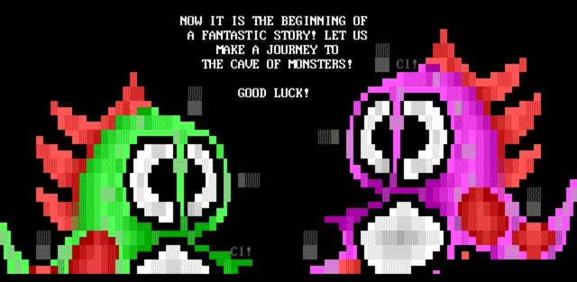

# Netizens: Online Communities && Digital Folklore

> life will be happier for the on-line individual because the people with whom one interacts most strongly will be selected more by commonality of interests and goals than by accidents of proximity — J.C.R. Licklider && Bob Taylor, [The Computer as a Communication Device](licklider-tayloer.pdf), 1968

## Early "networked" Communities

"In 1957, Joe Engressia first realized that he could control the phone system and make long-distance phone calls at no cost by whistling a specific pitch down the phone line. The AT&T phone network used twelve combinations of six audio tones as control signals. Engressia's whistles through the mouthpiece were interpreted as the phone company's own control tones. Engressia was one of a scattered group of technologically curious teenagers across the United States who spent their free time experimenting with controlling the phone system. These kids called themselves '**phone phreaks.**' Many were blind and were to some extent socially isolated among kids their own age. It was the phreaks, however, who first liberated themselves from reliance on their proximate peers. Theirs would be a community drawn together by the attraction of common interest rather than the strictures of geography" [Ryan]

"The WELL is a cherished destination for conversation and discussion. It is widely known as the primordial ooze where the online community movement was born — where Howard Rheingold first coined the term "virtual community." Since long before the public Internet was unleashed, it has quietly captivated some accomplished and imaginative people. Over the last two and a half decades, it's been described as "the world's most influential online community" in a Wired Magazine cover story" [[wikipedia](https://en.wikipedia.org/wiki/The_WELL)]]

"Life and death was shared in intimate detail online. The birth of the first baby of a Well member was celebrated in 1986; the first marriage between two members occurred in 1988; and the first death of a member, Blair Newman, was mourned in 1990. By 1995, the community had become so intimate that Tom Mandel, dying of cancer, bid his peers on The Well farewell with a depth of emotion rarely expressed in public: I'm sad, terribly sad, I cannot tell you how sad and grief stricken I am that I cannot stay to play and argue with you much longer. It seems almost as if I am the one who will be left behind to grieve for all of you dying ..." [Ryan]  

for more on these early communities read C[ommunities based on interest, not proximity](http://arstechnica.com/tech-policy/2011/03/from-the-first-email-through-the-well-and-usenet-a-pre-history-of-social-networking/) by a chapter from Johnny Ryan's book A History of the Internet and the Digital Future.

## BBS && the ANSI ArtScene

A bulletin board system, or BBS, is a computer system running software that allows users to connect and log into the system using a terminal program. Once logged in, a user can perform functions such as uploading and downloading software and data, reading news and bulletins, and exchanging messages with other users, either through email, public message boards, and sometimes via direct chatting. Many BBSes also offer on-line games, in which users can compete with each other, and BBSes with multiple phone lines often provide chat rooms, allowing users to interact with each other. [[wikipedia](https://en.wikipedia.org/wiki/Bulletin_board_system)].

u can watch [this episode of the Computer Chronicles](https://www.youtube.com/watch?v=Pb7te_HZyiA) to get a sense of BBSs at the time, or if u'd like to experience on urself u can visit a BBS using ur terminal app, simply type in `telnet URL PORT` (but replace 'URL' with a BBS address && PORT with the port number). u can find a directory of still active BBSs on [https://www.telnetbbsguide.com](https://www.telnetbbsguide.com). there u'll find URLs like "bbs.freeradical.zone:8888" a URL && port number separated by a colon. so to visit this particular BSS in ur terminal u would enter `telnet bbs.freeradical.zone 8888` (if no port is mentioned then simply enter the telnet command followed by the URL)

even though these BBSs could only display text, users realized that they could create “art” by creatively placing colored ASCII and ANSI text characters on a screen. a subculture of early computer “outsider” artists (not affiliated with established fine art institutions) flourished in the 80s. These artists (mostly high school students) would usually go by aliases or “handles” and would work in groups known as “crews.” Episode 5 of Jason Scott's (mentioned below) multi-part documentary on BBSs interviews folks from the BBS "[Artscene](https://www.youtube.com/watch?list=PLgE-9Sxs2IBVgJkY-1ZMj0tIFxsJ-vOkv&v=2t74FlFL_M0)".

## Geocities

> Most of us think nothing of putting our lives in the cloud; photos in Flickr, videos on YouTube, most everything on Facebook. But what about when those services abruptly go away, taking all of our collective contributions with them? Well Jason Scott operates on the assumption that everything online will one day disappear. He explains to Bob why he and the Archive Team are dedicated to saving user-generated content for posterity. — On The Media (from an episode that no longer seems to be online... this is why we need to archive everything!)

[Jason Scott](http://www.textfiles.com/jason/) && his [archive team](http://www.archiveteam.org/index.php?title=Main_Page) have saved lots of online folk-cultural works from extinction. the most popular of which ( in our net art circles ) is 1TB worth of geocities pages which they archived as a torrent. spend a few minutes perusing through [One Terabyte of Kilobyte Age](http://blog.geocities.institute/) (1TBKBA) (the geocities research blog lead by net artists Olia Lialina && Dragan Espenschied editors of [the DIGITAL FOLKLORE Reader](http://digital-folklore.org/))

The free web hosting service Geocities.com was founded by “Beverly Hills Internet” in July 1995 — exactly the time when the web left academia and started to be made by everyone of us. Soon it became one of the most popular and inhabited places of the WWW and stayed that way through the second part of 1990’s. In January 1999, on the peak of Dot.com mania, it was bought by Yahoo!. The new millennium proved Geocities to be a bad investment. Having a page on there became a synonym for dilettantism and bad taste. Furthermore, the time of personal home pages was counted, being replaced with profiles on social networks. Ten years later, in April 2009, Yahoo! announced that they are going to shut down the service. On the 26th of October 2009 Geocities seized to exist. In between the announcement and the official date of death a group of people calling themselves Archive Team managed to rescue almost a terabyte of Geocities pages. On the 26th of October 2010, the first anniversary of this Digital Holocaust, the Archive Team started to seed geocities.archiveteam.torrent [1TBKBA]

> "[In the beginning (the 90s) the web] was bright, rich, personal, slow and under construction....it was a web of amateurs soon to be washed away by dot.com ambitions, professional authoring tools and guidelines designed by usability experts." — Olia Lialina [the Vernacular Web v1](http://art.teleportacia.org/observation/vernacular/) 2005

> So, here’s the question: how does the Web look now, when it’s no longer seen as the technology of the future, when it’s intertwined with our daily lives and filled by people who are not excited by the mere fact of its existence? At a first glance, this question looks like a purely aesthetic one. One might think it’s almost unimportant. But in fact, nothing demonstrates the state of the Web in general and the state of its services, in particular the ones that follow the Web 2.0 ideology, as clearly as the style and look of ordinary users’ home pages.  — Olia Lialina [the Vernacular Web v2](http://contemporary-home-computing.org/vernacular-web-2/) 2007

## Netizens today

> "There are people online who actively contribute towards the development of the Net. These people understand the value of collective work and the communal aspects of public communications. These are the people who discuss and debate topics in a constructive manner, who e-mail answers to people and provide help to new-comers, who maintain FAQ files and other public information repositories, who maintain mailing lists, and so on. These are people who discuss the nature and role of this new communications medium. These are the people who as citizens of the Net, I realized were Netizens." —  Michael Hauben [Netizens: On the History and Impact of Usenet and the Internet](Netizens: On the History and Impact of Usenet and the Internet)

though this term was coined to describe the earliest days of the net && though many would argue that the netizen has gone extinct in the age of social media && surveillance capitalism, i think there are still various pockets of the modern Internet whose spirit can be traced back to these early communities, check out [glitch.com](https://glitch.com/) for example, or watch this PBS feature on the [culture of Reddit](https://www.youtube.com/watch?v=fXGs_7Yted8) or this TED talk by the [creator of 4chan](https://www.youtube.com/watch?v=a_1UEAGCo30) (...if u decide to check out 4chan itself, be warned! ...it's an uncensored corner of the net which can be both wonderful && horrifying, consider this an umbrella trigger warning).
