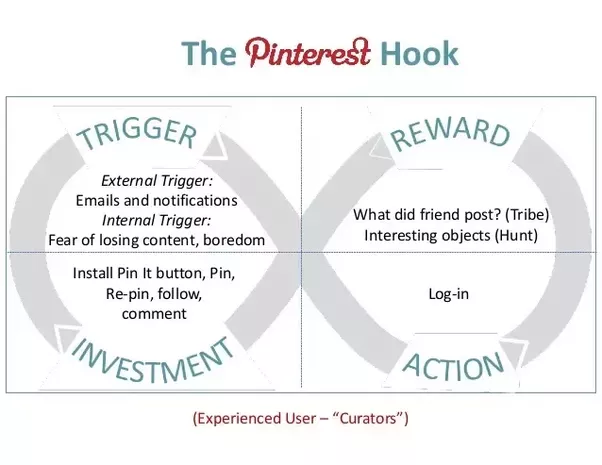

# the Age of Surveillance

## Privacy

"I've got nothing to hide..."

> Like many fundamental rights, privacy is one of those things that becomes noticed only when it’s gone. That’s unfortunate, because after it’s gone it’s much harder to regain. We have to stop the slide. Fundamentally, the argument for privacy is a moral one. It is something we ought to have—not because it is profitable or efficient, but because it is moral. Mass surveillance should be relegated to the dustbin of history, along with so many other practices that humans once considered normal but are now universally recognized as abhorrent. Privacy is a human right.

— Bruce Schneier form [Data and Goliath: The Hidden Battles to Collect Your Data and Control Your World](https://www.schneier.com/books/data_and_goliath/)

> **Surveillance Capitalism**, A new Economic order that claims human experience as free raw material for hidden commercial practices of extraction, prediction, and sales

— Shoshana Zuboff from [The Age of Surveillance Capitalism: The Fight for a Human Future at the New Frontier of Power ](https://www.goodreads.com/book/show/26195941-the-age-of-surveillance-capitalism)

[Roger McNamee](https://en.wikipedia.org/wiki/Roger_McNamee)

## Surveillance Capitalism

[Shoshana Zubof](https://en.wikipedia.org/wiki/Shoshana_Zuboff)

### the design (UX/UI) practice

On the subject of the prevailing tech business model today, as the saying goes, "when something is free, you're not the customer, you're the product." The vitamins vs painkiller question:

> A habit is when not doing an action causes a bit of pain. It is important to clarify that the term pain, as it is frequently used in business school and marketing books, is somewhat hyperbolic. In reality, the experience we are talking about is more similar to an itch, a feeling that manifests within the mind and causes discomfort until it is satisfied. The habit-forming products we use are simply there to provide some sort of relief. Using a technology or product to scratch the itch provides faster satisfaction than ignoring it. Once we come to depend on a tool, nothing else will do. My Answer to the vitamin versus painkiller question: Habit forming technologies are both. These services seem at first to be offering nice-to-have vitamins, but once the habit is established, they provide an ongoing pain remedy.

— Nir Eyal from [Hooked: How to Build Habit-Forming Products](https://www.goodreads.com/book/show/22668729-hooked)

[Tristan Harris](https://en.wikipedia.org/wiki/Tristan_Harris) (check out his NFP [the Center for Humane Technology](https://humanetech.com/))

see also: Aza Raskin on designing the Infinite Scroll

see also: see also [Lewis, Paul. 'Fiction is outperforming reality': how YouTube's algorithm distorts truth, the Guardian. Feb 2, 2018](https://www.theguardian.com/technology/2018/feb/02/how-youtubes-algorithm-distorts-truth)

see also: [https://www.darkpatterns.org/](https://www.darkpatterns.org/)

### types of data collected
a very high level set of data types collected by Facebook:

- **disclosed data**: the stuff you choose to share on Facebook

- **meta data**: data about the stuff you chose to share

- **behavioral data**: generated from your habits,  
ex: 'Self-Censorship', what you type but choose not to post  
source: [Madrigal, Alexis C. "71% of Facebook Users Engage in 'Self-Censorship'" the Atlantic. Apr 15, 2013](https://www.theatlantic.com/technology/archive/2013/04/71-of-facebook-users-engage-in-self-censorship/274982/)

- **third-party data:** from data brokers (shopping history, financials, etc.) 
source: [Opsahl, Kurt and Rainey Reitman. "The Disconcerting Details: How Facebook Teams Up With Data Brokers to Show You Targeted Ads" the Electronic Frontier Foundation. April 22, 2013](https://www.eff.org/deeplinks/2013/04/disconcerting-details-how-facebook-teams-data-brokers-show-you-targeted-ads#info-flow )

- **incidental data**: the stuff other people share about you
incidental and third-party data are used to produce "Shadow Profiles"
source: [Hill, Kashmir. "How Facebook Figures Out Everyone You've Ever Met" Gizmodo. Kashmir Nov 7, 2017](https://gizmodo.com/how-facebook-figures-out-everyone-youve-ever-met-1819822691?IR=T)

- **derived data**: data inferred by corrolating all of the above, ex: social class
  source: "Facebook Patents Tech To Bucket Users Into Different Social Classes". CB Insights Reserach Briefs. Feb 1, 2018

Tech companies used to record data to improve a product or service for the user they were recording data from. Take mouse movements for example. These could be recorded to do usability testing, researchers could analyze the data to see if a user was confused or missed an important part of an app or site. Today data is collected and used in various other ways that aren't necessarily geared towards improving the product for the users, but rather for the new customer, the folks who want the users attention, advertising:

> Algorithms find patterns shared by different users, based on their online behavior. This goes beyond their common interests to include things like the time, location, and other context elements of web activity. If User A does a dozen things online prior to buying a car—many of them unrelated to buying a car—the algorithm will look for other users who start down the same path and then off them ads to buy a car.

— Roger McNamee (Investor and former Facebook adviser)

Today, thanks to Machine Learning algorithms, comparing data across lots of users patterns can be found which are used to make unprecedented predictions and even manipulate our behavior. Consider what we can do with [mouse movement data](https://dl.acm.org/citation.cfm?doid=1029208.1029210) today. Your mouse movements are only one piece of the puzzle, data brokers (for whom buying and selling user data is their business) can have up to 400 data points on each individual.

## Predictive Algorithms (Artificial Intelligence && Machine Learning)

[Zeynep Tufekci](https://en.wikipedia.org/wiki/Zeynep_Tufekci)

### how does it work?

to learn more about the history of Machine Learning check out Bloomberg Businessweek's documentary on [The Rise of AI](https://www.youtube.com/watch?v=Dk7h22mRYHQ&list=PLqq4LnWs3olVtd-fSbmz8a0KhoBCB8JW4&index=14)

to learn more about how machine learning actually works, check out PBS Digital Studio's [Crash Course: Machine Learning](https://www.youtube.com/watch?v=GvYYFloV0aA&list=PL8dPuuaLjXtO65LeD2p4_Sb5XQ51par_b&index=1) on YouTube.

What we can do with Machine Learning today is astonishing, from realtime language translation, to self driving cars, to generative music that moves us to tears; for a couple of visceral examples check out [https://www.thispersondoesnotexist.com/](https://www.thispersondoesnotexist.com/) as well as the [Open AI's GPT-2 model](https://talktotransformer.com/)

### the promises...

> As AI progresses, the great promise is that these machines alongside of us are able to think, imagine and see things in ways that we never have before. Which means that maybe we have some new, weird, seemingly implausible solution to climate change, maybe we have some radically different approach to dealing with incurable cancers. The real practical and wonderful promise is that machines help us be more creative and using that creativity we get to terrific solutions.

 — Amy Webb (from the video below)

- [Google predicts traffic patterns really really well based on motion sensors in our phones.](https://www.businessinsider.com/how-google-maps-knows-about-traffic-2015-11)

- [Google uses machine learning to understand how to optimize energy use at its data centers.](https://googleblog.blogspot.com/2014/05/better-data-centers-through-machine.html)

- [Spotiy uses machine learning to create your "discover playlist"](https://www.theverge.com/2015/9/30/9416579/spotify-discover-weekly-online-music-curation-interview)

### the perils...

-  "Orbitz showed higher-priced hotels to owners of Mac computers, for instance. Staples offered the same products at higher prices to people living in certain ZIP codes. Last year, we found that The Princeton Review was charging different prices for its online SAT tutoring course in different ZIP codes. In some ZIP codes, the course cost $6,600; in others that same course was offered for as much as $8,400." ..."Our analysis found that Asians were nearly twice as likely to get that higher price from The Princeton Review than non-Asians."
read more"differential pricing" algorithms on [propublica](https://www.propublica.org/article/breaking-the-black-box-when-algorithms-decide-what-you-pay)

- "When the Chicago Police Department sent one of its commanders to Robert McDaniel’s home last summer, the 22-year-old high school dropout was surprised." read more about predictive policing on [the Verge](https://www.theverge.com/2014/2/19/5419854/the-minority-report-this-computer-predicts-crime-but-is-it-racist) , [Bloomberg](https://www.bloomberg.com/opinion/articles/2018-02-28/artificial-intelligence-in-policing-advice-for-new-orleans-and-palantir), [Wired](https://www.wired.com/story/how-peter-thiels-secretive-data-company-pushed-into-policing/) and [the Guardian](https://www.theguardian.com/uk-news/2019/apr/20/predictive-policing-tool-could-entrench-bias-ethics-committee-warns)

- [This Company Uses AI To Help Lenders Automate The Mortgage Loan Process](https://www.forbes.com/sites/julianmitchell/2017/08/22/this-company-uses-ai-to-help-lenders-automate-the-mortgage-loan-process/#73c099c72809)

- Some companies are starting to use AI as a recruitment tool and/or to vet applicant resumes, including [Amazon] (https://www.theguardian.com/technology/2018/oct/10/amazon-hiring-ai-gender-bias-recruiting-engine)

- see also Bias in Machine Learning section below

## Alternative takes on the Business Model

Duolingo

Cryptomining, ex: [coinhive](https://github.com/cazala/coin-hive), [cpuminer](https://github.com/pooler/cpuminer) *discuss ethical v malicious approaches*

# Other Side Effects of Surveillance Capitalism

## Bias in Machine Learning

> "The coded gaze reflects the priorities, preferences and prejudices of those who have the power to shape technology"

— Joy Buolamwini (from the video below)

[Joy Buolamwini](also chck out her org the [Algorithmic Justice League](https://www.ajlunited.org/))

>  "Scores like this — known as risk assessments — are increasingly common in courtrooms across the nation. They are used to inform decisions about who can be set free at every stage of the criminal justice system, from assigning bond amounts — as is the case in Fort Lauderdale — to even more fundamental decisions about defendants’ freedom. In Arizona, Colorado, Delaware, Kentucky, Louisiana, Oklahoma, Virginia, Washington and Wisconsin, the results of such assessments are given to judges during criminal sentencing."

— [propublica](https://www.propublica.org/article/machine-bias-risk-assessments-in-criminal-sentencing)

[Julia Angwin](https://en.wikipedia.org/wiki/Julia_Angwin) (fromer ProPublica reporter, check out her recent org [The Markup](https://themarkup.org/))

## Government Surveillance

> A society in which people can be monitored at all time, is a society that breeds conformity and obedience and submission. Which is why every tirent, [from] the most overt to the most subtle, craves that system. Conversely, even more importantly, it is a realm of privacy, the ability to go somewhere where we can think, and reason and interact and speak without the judgmental eyes of others being cast upon us, in which creativity and exploration and decent exclusively reside.

— Glenn Greenwald (from his TED talk linked below)

## the "[stamp collector](https://www.youtube.com/watch?v=tcdVC4e6EV4)" problem

[Tom Scott](https://en.wikipedia.org/wiki/Tom_Scott_(entertainer)

## Playground for Hackers

see also: [my privacy guide notes](privacy-guide.md) (NOTE: this needs updating)
