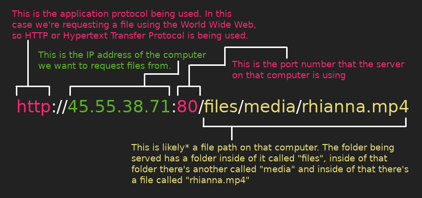
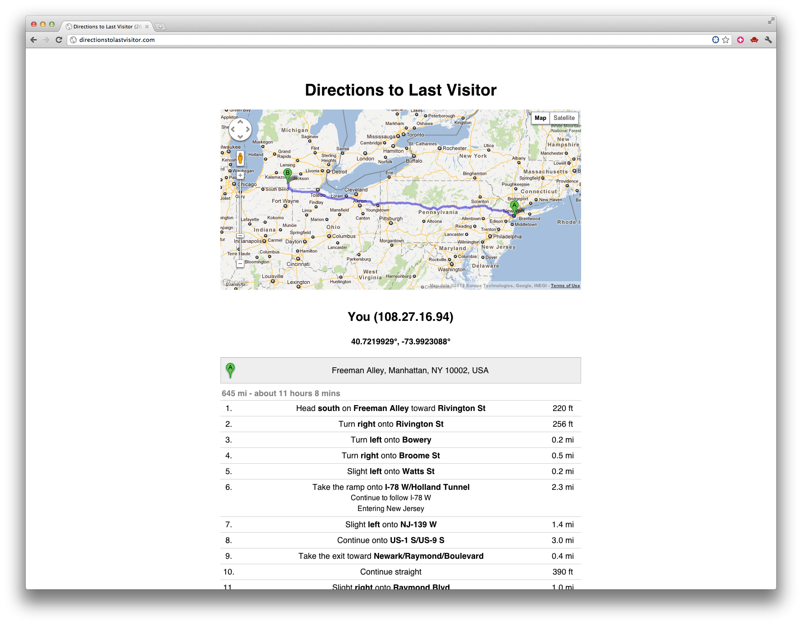
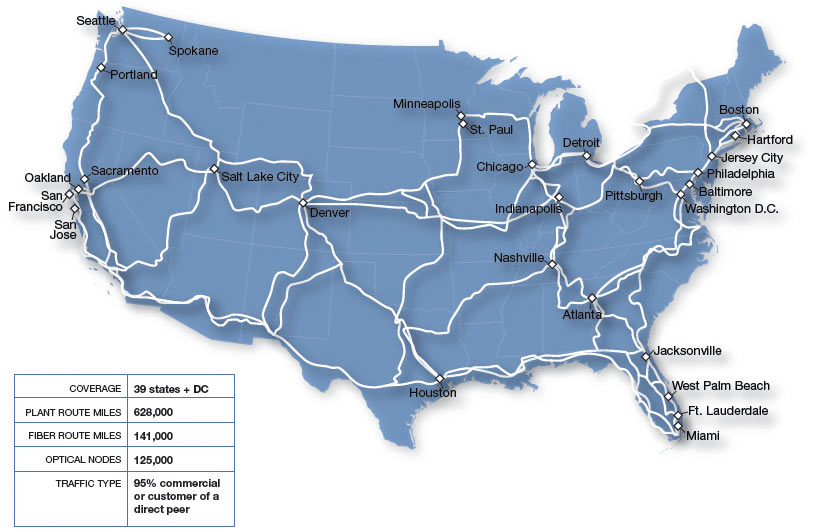
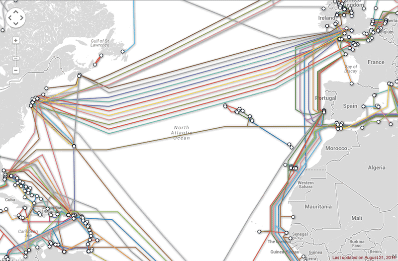

#  wtf is the Internet ???

> Internet \in"ter*net\, n. A deeply misunderstood technology upon which we increasingly depend

[Julian Oliver & Danja Vasiliev](https://www.youtube.com/watch?v=v8IlNpefM6s)

> The Internet is the great masterpiece of human civilization. As an artifact it challenges the pyramid, the aqueduct, the highway, the novel, the newspaper, the nation-state, the Magna Carta, Easter Island, Stonehenge, agriculture, the feature film, the automobile, the telephone, the telegraph, the television, the Chanel suit, the airplane, the pencil, the book, the printing press, the radio, the realist painting, the abstract painting, the Pill, the washing machine, the skyscraper, the elevator, and cooked meat. As an idea it rivals monotheism

Virginia Heffernan (from her book [Magic and Loss: The Internet as Art](https://www.nytimes.com/2016/06/12/books/review/virginia-heffernans-magic-and-loss.html). Simon & Schuster. 2016.)


[right down every question u have about the Internet here](https://docs.google.com/document/d/1Y-Dh8TBOQn0yM2XwJUefxeO-rt48C-EN8YinvtvlMIw/edit)


-----


## networking demo

code for running a python server.
Open a terminal an navigate to the folder you want to serve:
```bash
cd path/to/folder
```
Then depending on which version of python you have installed, launch the server. For python 2:
```bash
python -m SimpleHTTPServer
```
and for python 3:
```bash
python -m http.server
```
if you don't know what version of python you have installed you can check first by running:
```bash
python --version
```

Now (assuming you've got the proper Sharing Settings set on your computer) another computer on the same network as you can request files from you using your local IP address. Your local IP address is listed in the Sharing section of your Settings, but you can also find it using the terminal. Enter `ifconfig` into your terminal (press enter) and look for the IP address next to the "inet" section of your WiFi card (which will show up in the outputed list)

Let's assume for deomonstration that your local IP address is 192.168.0.10, the other computer on the same network can now request data from your computer using the `curl` command in the terminal, for example:
```bash
curl http://192.168.0.10:8000/path/to/file.txt
```
or simply type that same URL into the address bar of a browser.

### Domain Names vs IP (Internet Protocol) addresses

When you sign on to a local WiFi (or ethernet) network the router assigns you a "local" IP address, the router itself has a public IP address, this address is a unique address on the Internet. When your request packets leave your local network, your IP address is swapped with your router's address, this way the response (which could be coming from a computer half way across the world) knows to find it's way back to you. If you'd like to see what your public IP address is (ie. your router's IP address) do a web search for "[what's my IP address](https://duckduckgo.com/?q=what%27s+my+ip+address&t=canonical&atb=v137-1&ia=answer)"


URL (Universal Resource Locator)


We rarely type IP address into our browser address bars, this is because a server could optionally register a "domain name" on the Internet's Domain Name System (DNS). This is like a giant phone book (or books) for the Internet that match names to numbers.

[](https://youtu.be/2ZUxoi7YNgs?t=1272)

Here you can find a list of all the [The Root Servers](https://www.iana.org/domains/root/servers) for the DNS. You can look up any domain name's IP address by using the `nslookup` command in your terminal.

[](http://citizen-ex.com/)

"Citizen Ex" by James Bridle


### tracing our packet's route

[](https://youtu.be/h7guR5ei30Y)


"Directions ot Last Visitor" by Charles Broskoski

1. visit a website in your browser, right-mouse click the page and "View Source." This is the HTML code, the file itself, that just traveled the world to reach your computer.

2. In your terminal, type: `nslookup thewebsite.com`
to find the IP address of the server the website you visited is "hosted" on (replace "thewebsite.com" with your website). Your browser handles this lookup for you, first by asking your ISP and if they don't know the request get's passed along to one of these [Root Domain Server](http://root-servers.org/).


4. Sites like [whatismyipaddress.com/ip-lookup](https://whatismyipaddress.com/ip-lookup) && [ip2location.com](http://www.ip2location.com/demo) can tell u where that server is physically located

5. In your terminal, type: `traceroute somewebsite.com` or `mtr somewebsite.com` (if you have mtr installed) to follow the path that file took to get from here to there. It takes less than a second (only milliseconds) to "hop" through dozens of computers around the world.


 Comcast's fiber network across the country


[this undersea cable its on its way to Cuba from Venezuela](http://runrun.es/runrunes/23374/la-corrupcion-cubana-en-empresas-bajo-las-ordenes-de-ramiro-valdes-salpicaria-a-venezuela-y-su-cable-de-fibra-a-cuba.html)



- [view interactive undersea cable map](http://www.submarinecablemap.com/)
- [view interactive network exchange points map](http://www.internetexchangemap.com/#/)


["This modest indentation on the Canadian coastline is a major Internet landmark, a sort of Ellis Island of the Web: It’s where a submarine cable owned by Hibernia Atlantic comes ashore."](http://andrewblum.net/2009/netscapes-wired-magazine/)


